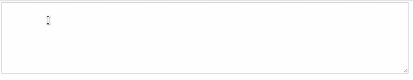

# VueTextAreaTag [](https://travis-ci.com/abakermi/vue-textarea-tag) [](https://badge.fury.io/js/vue-textarea-tag)

> vue component to add tags to textarea element


****

## **Install**

```
$ npm install -g vue-textarea-tag
```


## Usage

```js  
import VueTextAreaTag from 'vue-textarea-tag';

Vue.use(VueTextAreaTag);

// use it 
<VueTextAreaTag :tags="yourtags" :color="bgcolor" @input="dosomething"  />

```
## Attributes


#### tags

Type: `array`

list of tags

#### color

Type: `string`

background color of tag


## Events

#### @input

get current value of textarea

## License

MIT © [Abdelhak Akermi](https://github.com/abakermi)